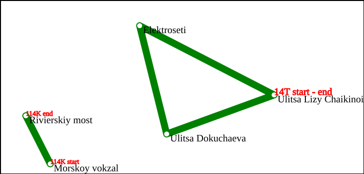

# TransportCatalogue

**TransportCatalogue** — это система для управления и обработки транспортных данных, включающая в себя парсинг данных в
формате JSON, обработку географической информации и визуализацию маршрутов на карте с помощью SVG.

## Основные возможности

- **Парсинг данных** из JSON-файлов.
- **Обработка географических данных**, включая работу с транспортными остановками и маршрутами.
- **Отображение маршрутов** на карте с использованием SVG.
- **Автоматическое тестирование** функциональности с помощью Google Test.

## Структура проекта

- `Autotests/` — директория с автоматическими тестами, написанными с использованием Google Test. Тесты проверяют
  основные модули проекта.
- `Geography_src/` — исходный код для работы с географическими данными. Включает модули для управления остановками и
  маршрутами.
- `Json_parser_src/` — исходный код для парсинга данных в формате JSON. Модули загружают и анализируют данные для работы
  с маршрутами.
- `Mapping_src/` — исходный код для отображения транспортных маршрутов в формате SVG.
- `main.cpp` — главный файл программы, в котором объединены все модули проекта.
- `test.json` — пример JSON-файла для парсинга и тестирования функциональности проекта.

## Пример работы с входным файлом test.json (результат в result.svg)



## Запуск на Linux

Для сборки и запуска проекта на Linux выполните следующие команды:

```bash
sudo apt-get install cmake g++ && mkdir build && cd build \
cmake ../ && make -j`nproc` && cd ../ && chmod +x ./build/transport_catalogue && ./build/transport_catalogue
